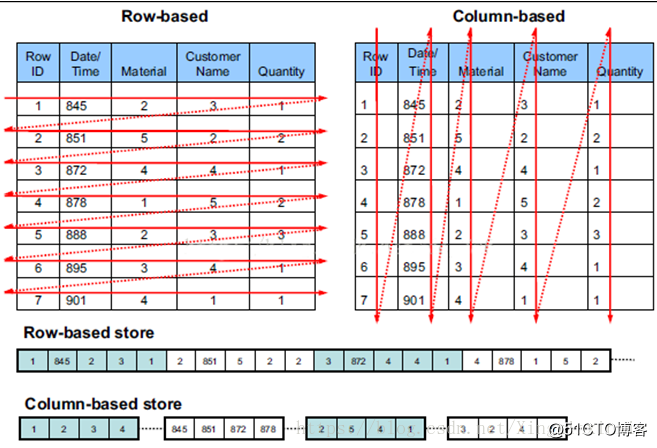
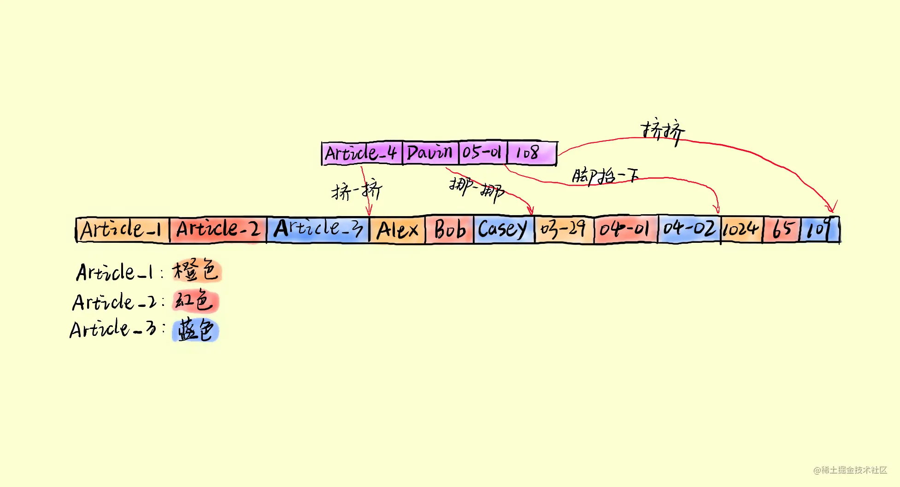
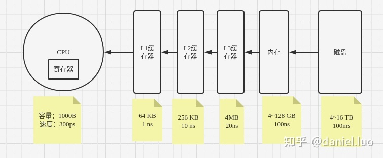

---
layout: post
title: 列存储与向量化执行
description: 
tags: ["bigdata"]
giscus_comments: true
related_posts: false
# tags: tags 配置路径:  _config.yml -> display_tags 
# giscus_comments: git 留言框
---

# 什么是列存储

> 我们知道，在SQL Server里，Page是数据存储的基本单位，而数据行是实际数据的存储单位，它们从Page > Header之后就开始依次存储在Page上。这种按行在Page上存储记录的方式就是行存储。当数据是按单列而不是多行进行连续存储时，就是所谓的列存储。

列式存储(column-based)是相对于传统关系型数据库的行式存储(Row-basedstorage)来说的。简单来说两者的区别就是如何组织表：

**行存储**: 基于行的存储按行顺序存放数据。它利于数据一行一行的写入，写入一条数据记录时，只需要将数据追加到已有数据记录后面即可。行模式存储适合 OLTP(Online Transaction Processing)系统。因为数据基于行存储，所以数据的写入会更快。对按记录查询数据也更简单。

**列存储**:基于列的存储可按列顺序存放数据。可以方便的取出某一列的全部数据,且只需一次磁盘操作即可。但数据更新复杂度提高,当一条新数据到来，需要将每一列存储到对应的位置。这样就需要多次写磁盘操作。如下图

## 对比
|  Row-Store   | Column-Store  |
|  ----  | ----  |
| 因为按一行一行写和读取数据，因此读取数据时往往需要读取那些不必要的列  | 可以只读取必要的列 |
| 易于按记录读写数据  | 对一个一个记录的数据写入和读取都较慢 |
| 适合 OLTP 系统  | 适合 OLAP 系统 |
| 不利于大数据集的聚合统计操作  | 利于大数据集的数据聚合操作 |
| 不利于压缩数据  | 利于压缩数据 |

# 什么是向量化执行
**简单理解为就是消除程序循环的优化**
> 向量化计算是一种特殊的并行计算的方式，相比于一般程序在同一时间只执行一个操作的方式，它可以在同一时间执行多次操作，通常是对不同的数据执行同样的一个或一批指令，或者说把指令应用于一个数组/向量。

## 基石

离CPU越远访问越慢

## 向量化执行速度快的原理:

1. SIMD 处理 (Single Instruction Multiple Data) 即单条指令操作多条数据——原理即在CPU 寄存器层面实现数据的并行操作。SIMD 指令允许在同一时钟周期内，对不同的列数据执行相同的指令, 实际上执行吞吐量（throughput of execution）可以提高 4 倍或更多。

2. 列存储
每列的数据存储在一起，可以认为这些数据是以数组的方式存储的，基于这样的特征，当该列数据需要进行某一同样操作，可以使用SIMD进一步提升计算效率，即便运算的机器上不支持SIMD, 也可以通过一个循环来高效完成对这个数据块各个值的计算。

## 向量化执行引擎的优势
1. 向量化执行引擎可以减少节点间的调度，提高CPU的利用率
2. 因为列存数据，同一列的数据放在一起，导致向量化执行引擎在执行的时候拥有了更多的机会能够利用的当前硬件与编译的新优化特征
3. 因为列存数据存储将同类型的类似数据放在一起使得压缩比能够达到更高，这样可以拉近一些磁盘IO能力与计算能力的差距