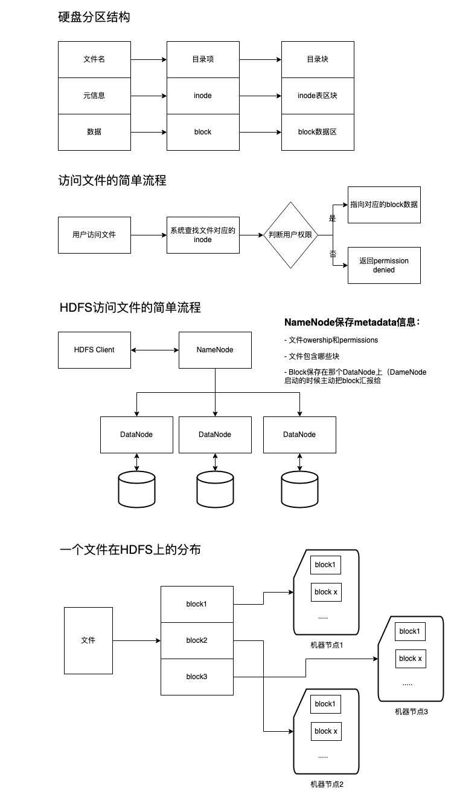
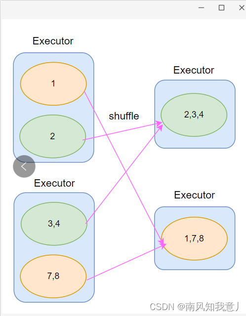
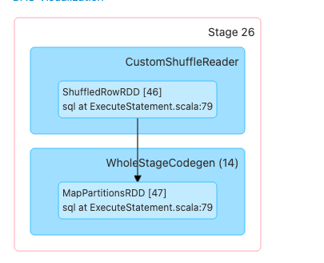
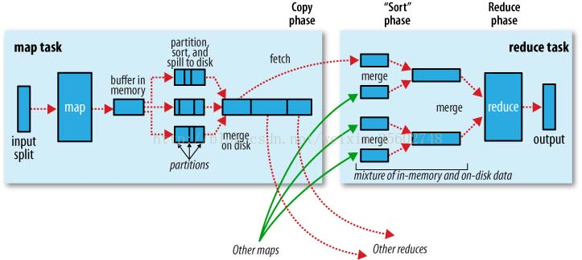

# 引言

在漫谈小文件问题之前，先介绍几个重要的知识点.

**"块"(block)**

文件储存在硬盘上，硬盘的最小存储单位叫做"扇区"（Sector）。每个扇区储存512字节（相当于0.5KB）。
操作系统读取硬盘的时候，不会一个个扇区地读取，这样效率太低，而是一次性连续读取多个扇区，即一次性读取一个"块"（block）。这种由多个扇区组成的"块"，是文件存取的最小单位。"块"的大小，最常见的是4KB，即连续八个 sector组成一个 block。

**磁盘inode:**

记录储存文件的元信息，比如文件的创建者、文件的创建日期、文件的大小等等。这种储存文件元信息的区域就叫做inode，中文译名为"索引节点"。inode是有限的。试想，当有成千上万的小文件存在于服务器的文件系统当中时，最先消耗完的肯定不是磁盘的空间，而是inode，这就会导致大量的空闲空间无法使用。（深入了解inode可查看[这篇大佬的博客](http://www.ruanyifeng.com/blog/2011/12/inode.html)）

**NameNode（HDFS）:**

NameNode管理着整个HDFS文件系统的元数据。 存储着数据文件的元信息，比如文件的创建者、文件的创建日期、文件的大小等等。数据存储在内存中。

**在这里我用一个图描述一下，方便大家记忆**
   

# 小文件的定义 (HDFS)
在HDFS中，一个bolck块的默认大小是128M，当一个文件的大小小于一个block的大小，则被认为是小文件。

**工厂小文件特征项解释:**
同一分区目录或文件目录下，存在文件数量 > 10，且文件平均大小 < 128MB，则称该分区下「小文件过多」。表最近七天修改的路径存在小文件过多，则记为0分

# 小文件的危害
对于硬盘:
1. 不合理的消耗inode的空间，且会造成磁盘利用率很低。
2. 因为读取文件首先读写的是inode，小文件过多会影响文件的读取速度。

对于数据处理（Spark、hive、HDFS等）
1. NameNode（HDFS）需要的内存大大增大，增加NameNode压力，这样会限制了集群的扩展。
2. 在HDFS中，小文件的读写处理速度要远远小于大文件。
3. Hive中，小文件会开很多map，一个map开一个JVM去执行，所以这些任务的初始化，启动，执行会浪费大量的资源，严重影响性能。

# 如何处理小文件

## Hive

```SQL
--添加设置参数即可处理小文件 
-- 如果一个 job 结束后，生成的文件的平均大小 小于 参数 hive.merge.smallfiles.avgsize 设定的值，则认为是小文件。则按照 hive.merge.size.per.task 设定至进行合并
-- 如果一个 job 结束后，生成的文件的平均大小 小于 200M 则按照256M一个文件进行合并
set hive.merge.mapfiles = true;
set hive.merge.mapredfiles = true;
set hive.merge.size.per.task = 256000000;
set hive.merge.smallfiles.avgsize = 200000000;
```

## SparkSQL

#### 方法一:
``` SQL
-- 使用进行小文件治理  distribute by cast( rand * N as int) 这里的N是指具体最后落地生成多少个文件数
-- distribute by cast(rand() * 10 as int);  生产10个文件 如数据文件总大小为1G则生产10个100m的文件

例如:
set spark.sql.shuffle.partitions=50;
set spark.sql.adaptive.minNumPostShufflePartitions=1;
set spark.sql.adaptive.enabled=true;
set spark.sql.adaptive.shuffle.targetPostShuffleInputSize=256000000;
insert overwrite table xxx.xxx partition (date = ${date - 1})
select * from xxx.xxx
distribute by cast(rand() * 10 as int)
```

## Spark
```Scala
df.coalesce(numFiles,true).write.mode(SaveMode.Overwrite).parquet(dest) //不触发shuffle，比如将1000个文件合并成100个
df.coalesce(numFiles,false).write.mode(SaveMode.Overwrite).parquet(dest) //触发shuffle，比如将1个文件拆分成10个文件 ==repartition

df.repartition(numFiles).write.mode(SaveMode.Overwrite).parquet(dest) //触发shuffle，比如将1个文件拆分成10个文件

```

#### 方法二:

Coalesce and Repartition Hint
将Hive风格的Coalesce and Repartition Hint 应用到Spark SQL需要注意这种方式对Spark的版本有要求，建议在Spark2.4.X及以上版本使用，示例：
```
INSERT ... SELECT /*+ COALESCE(numPartitions) */ ...
INSERT ... SELECT /*+ REPARTITION(numPartitions) */ ...
```
repartition只是coalesce接口中shuffle为true的实现  
coalesce中的shuffle参数设置为true,会重新混洗分区,涉及shuffle过程
coalesce shuffle参数为false的情况, 涉及shuffle过程, 它是合并分区, 比如把原来1000个分区合并成100个,

**shuffle的‘危害’**
coalesce 和 repartition 这两个算子都是用于数据重分布、调整任务的并行度，以便提升 CPU 的使用效率
但是它有个致命的缺陷，无论是增加分区数还是减少分区数，repartition 算子都是通过 shuffle 实现的，shuffle 就是把数据打乱，将数据重新分发，可以结合下面这张图理解。
  
shuffle 势必就会导致磁盘 IO 和 网络 IO 开销较大，性能也就会下降。

[Coalesce and Repartition 区别 详见](https://blog.csdn.net/Lzx116/article/details/124918769)

## Flink
#### 方法一:减小并行度
1. 并行度设置之Operator Level
算子、数据源和sink的并行度可以通过调用 **setParallelism()** 方法来指定
```java
final StreamExecutionEnvironment env = StreamExecutionEnvironment.getExecutionEnvironment();
DataStream<String> text = [...]
DataStream<Tuple2<String, Integer>> wordCounts = text
.flatMap(new LineSplitter())
.keyBy(0)
.timeWindow(Time.seconds(5))
.sum(1).setParallelism(5);
wordCounts.print();
env.execute("Word Count Example");
```

2. 并行度设置之Execution Environment Level
执行环境(任务)的默认并行度可以通过调用**env.setParallelism(3)**方法指定。为了以并行度3来执行所有的算子、数据源和data sink， 可以通过如下的方式设置执行环境的并行度：
```java
final StreamExecutionEnvironment env = StreamExecutionEnvironment.getExecutionEnvironment();
env.setParallelism(3);
DataStream<String> text = [...]
DataStream<Tuple2<String, Integer>> wordCounts = [...]
wordCounts.print();
env.execute("Word Count Example");
```
#### 方法二:
下游任务合并处理，Flink将数据写入到HDFS后，开启Hive或Spark定时任务，通过改变分区方式将数据写入新目录。


# 思考 
1. 文件并不是越大越好吗
* 如果块的大小设置过于大，寻址时间很快，但是数据传输的
* 造成分区数据倾斜，严重影响处理效率。

在这里要说明一下 适当的文件个数能提高下游任务数据并行度，太多的小文件对后续使用该表进行计算时会启动很多不必要的maptask，任务耗时高。


2. distribute by rand()的作用
distribute by ：用来控制map输出结果的分发，即map端如何拆分数据给reduce端。 会根据distribute by 后边定义的列，根据reduce的个数进行数据分发，默认是采用hash算法。
当 distribute by 后边跟的列是：rand()时，即保证每个分区的数据量基本一致。

**简而言之，是对数据进行重新分割的一个语法，保障分割后的每个文件的数据量基本一致。**

> 在这里给大家提个个问题 如果一个SQL生成文件的大小为50G 使用Spark distribute by cast(rand() * 1 as int) 生产一个文件 会产生什么问题?

这里直接说结果 如果没有其他配置参数的话会报一个OOM
在生产1个文件这个阶段涉及 CustomShuffleReader 这个过程
  

抓过来的数据首先肯定是放在Reducer端的内存缓存区中的（Spark曾经有版本要求只放在内存缓存中，数据结构类似于HashMap（AppendOnlyMap）显然特别消耗内存和极易出现OOM，同时也从Reducer端极大的限制了Spark集群的规模），现在的实现都是内存+磁盘的方式(数据结构使用ExternalAppendOnlyMap)，当然也可以通过Spark.shuffle.spill=false来设置只能使用内存。使用ExternalAppendOnlyMap的方式时候如果内存使用达到一定临界值，会首先尝试在内存中扩大ExternalAppendOnlyMap（内部有实现算法），如果不能扩容的话才会spill到磁盘。
  


**hive sql 原理和spark差不多**


# 文章参考

1. [深入理解web开发中海量小文件带来的的危害及解决方案](http://www.pingtaimeng.com/article/detail/id/2119447)
2. [深入理解磁盘文件系统之inode](http://t.zoukankan.com/thinksasa-p-3013445.html)
3. [Spark Shuffle 详解](https://zhuanlan.zhihu.com/p/67061627)